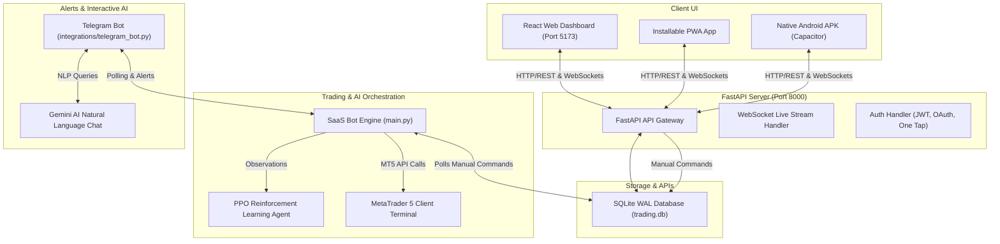

# 📈 NUR Trading Bot Dashboard & ML Engine

[](https://fastapi.tiangolo.com)
[](https://react.dev)
[](https://vitejs.dev)
[](https://python.org)
[](https://github.com/DLR-RM/stable-baselines3)
[](https://www.metatrader5.com)

**NUR** is a production-grade, event-driven multi-tenant SaaS algorithmic trading engine designed for XAUUSD (Gold) trading on MetaTrader 5. It integrates a live execution engine, a reinforcement learning (PPO) training/evaluation pipeline, a responsive React-based management dashboard, a Telegram command center with Gemini AI integration, and standalone mobile app installers (PWA/Android).

---

## 🛠️ System Architecture



---

## ✨ Core Features

### 1. Multi-Tenant SaaS Engine
*   **User Isolation**: Dynamic loading of tenant configurations, risk multipliers, credentials (MT5 logins), and statistics. *Multi-tenant architecture is pre-configured, currently running in optimized single-user local mode for demo validation.*
*   **Multi-tenant Database Schema**: SQLite database running in **WAL (Write-Ahead Logging)** mode for concurrent high-speed reads/writes without trade locking.

### 2. Premium Real-Time React Dashboard
*   **WebSocket Stream**: Instant updates (1-second updates) of floating equity, balance, active trades list, and trading metrics.
*   **Interactive Control Panel**: Start/stop trading loops, adjust risk multipliers on the fly, and send forced manual orders (`BUY`, `SELL`, `CLOSE ALL`).
*   **Google One Tap Login**: Modern, zero-click authentication with real Google Identity JWT credential validation.

### 3. Machine Learning (PPO) Pipeline
*   **Custom Gym Environment**: Custom Gymnasium-compliant environment (`XAUUSDTradingEnv`) with normalized observation parameters (RSI, MACD, EMA distance, normalized ATR, London/NY/Asian sessions).
*   **History Fetcher**: Chunk-based historical XAUUSD data downloader to prevent API timeouts.
*   **Train/Val/Test Splits**: Rigorous evaluation pipeline splitting data into 70% Train, 15% Validation, and 15% Test datasets to prevent overfitting.
*   **Validation check**: Automatic post-training validation phase evaluating model generalisation on unseen validation curves.
*   **True Evaluation**: Runs deterministic out-of-sample evaluations on test splits and saves equity curve plots.

### 4. Installable Mobile Application (PWA / Android APK)
*   **Progressive Web App (PWA)**: Full manifest, offline caching, and standalone browser app installers for Android and iOS.
*   **Native Android Project**: Pre-configured Capacitor integration in `dashboard/android/` for compilation to native Android APKs.

### 5. Telegram Commands & Gemini AI Chat
*   **Interactive Controls**: Run remote commands: `/start_trading`, `/stop`, `/status`, `/balance`, `/positions`, `/report`, and `/panic` (emergency close all).
*   **Gemini Chat**: Ask the bot questions about system health, current trades, and performance reports in plain Hinglish or English using Gemini AI.

---

## 📁 Repository Layout

```
Nur-main/
├── api/                   # FastAPI Backend Routing
│   ├── auth.py            # OAuth, Google One Tap, JWT endpoints
│   └── main.py            # API Gateway endpoints, WebSocket streams
├── core/                  # Core Algorithmic trading components
│   ├── engine.py          # Trading loop coordinator
│   ├── strategy.py        # Trend/pullback rules (H4, H1, M1)
│   └── risk.py            # Session management, Drawdowns
├── dashboard/             # React Frontend Client
│   ├── public/            # Static assets (PWA manifest, icons)
│   ├── src/               # React Code (components, hooks, pages)
│   └── android/           # Capacitor Native Android Studio project
├── data/                  # SQLite DB, Splits, and Historical CSVs
├── database/              # SQLite managers, Migrations, Seeders
├── indicators/            # Technical analysis indicators (RSI, MACD)
├── integrations/          # Telegram Bot & Gemini AI Client
├── rl/                    # Reinforcement learning pipeline
│   ├── agent.py           # Inference Agent (loads PPO models)
│   ├── evaluate.py        # Out-of-Sample evaluation script
│   ├── trading_env.py     # Gymnasium environment
│   └── train.py           # Stable-Baselines3 training script
├── scripts/               # DB Backups, historical data fetchers
├── main.py                # Main system coordinator
├── bot_engine.py          # Multi-tenant live trading engine
├── run_all.bat            # Standard launcher script
├── requirements.txt       # Python dependencies list
└── .env.example           # Example environment variables template
```

---

## 🚀 Installation & Quick Start

### 1. Prerequisites
*   Python **3.11.x**
*   NodeJS **18.x** or **20.x**
*   MetaTrader 5 Client Terminal installed on Windows.

### 2. Backend Installation
Clone the repository and run:
```bash
# Install python dependencies
pip install -r requirements.txt
```

### 3. Environment Configuration
Create a `.env` file in the root folder with the following variables:
```ini
# MetaTrader 5 Configurations
MT5_LOGIN=5051162188
MT5_PASSWORD=your_password
MT5_SERVER=MetaQuotes-Demo

# Telegram Bot API Configurations
TELEGRAM_TOKEN=your_telegram_bot_token
ALLOWED_CHAT_IDS=[123456789]

# Google Sign-In Configurations
GOOGLE_CLIENT_ID=your_google_client_id.apps.googleusercontent.com
GOOGLE_CLIENT_SECRET=GOCSPX-your_client_secret
GOOGLE_REDIRECT_URI=http://localhost:8000/api/auth/google/callback
VITE_GOOGLE_CLIENT_ID=your_google_client_id.apps.googleusercontent.com

# System Configurations
JWT_SECRET=nur-jwt-secret-your-custom-string
GEMINI_API_KEY=your_gemini_api_key
```

### 4. Running the Dashboard Web UI
Install frontend dependencies and start Vite dev server:
```bash
cd dashboard
npm install
npm run dev
```
The interface will be served at `http://localhost:5173`.

### 5. Running the Bot & API Server
Run the quick-start batch script:
```bash
run_all.bat
```
This script automatically:
1. Launches MetaTrader 5.
2. Starts the Bot watchdog (`main.py` which boots the Bot engine and Telegram bot).
3. Launches the FastAPI server (Port `8000`).

---

## 🤖 3-Agent MARL Reinforcement Learning Pipeline

To train and evaluate the multi-agent reinforcement learning (MARL) framework, follow these steps:

### Step 1: Download Historical Data from MT5
Ensure MetaTrader 5 is running and logged in. Run:
```bash
python scripts/fetch_history.py
```
This downloads 3 years of M1 bars, splits the dataset, and saves them to:
*   `data/train_xauusd_m1.csv` (70% training split)
*   `data/val_xauusd_m1.csv` (15% validation split)
*   `data/test_xauusd_m1.csv` (15% testing split)

### Step 2: Train the MARL Framework (HMM + PPO Trend & Range)
Train the HMM classifier followed by the specialized reinforcement learning agents:
```bash
# Fits HMM on historical data and trains specialized Trend & Range PPO agents for 2,000,000 steps each
python -m rl.train --timesteps 2000000
```
This script automates:
1.  **HMM Fitting**: Fits transition and emission probabilities on training data and saves the parameters to `rl/models/hmm_model.json`.
2.  **Trend Agent Training**: Trains a PPO agent (`ppo_trend.zip`) in a custom environment filtered exclusively for HMM Trend states.
3.  **Range Agent Training**: Trains a PPO agent (`ppo_range.zip`) in a custom environment filtered exclusively for HMM Range states.
4.  **Fallback Agent Training**: Trains a PPO agent (`ppo_xauusd.zip`) on the full training dataset as a universal fallback agent.

### Step 3: Out-of-Sample Evaluation
Evaluate the trained agents on the out-of-sample test split:
```bash
python -m rl.evaluate
```
This executes backtests for individual agents and the combined **HMM-routed MARL Orchestrator** (`RLAgent`), calculates metrics (Sharpe ratio, drawdown, win rates), and plots the out-of-sample equity curve to `rl/results/equity_curve.png`.

---

## 🧠 Mathematical & RL Framework

### 1. Market Regime Router (HMM Classifier)
The framework partitions market regimes into hidden states using a Gaussian Hidden Markov Model:
*   **Observations ($X_t$)**: 3D feature vector $\mathbf{x}_t = \left[ \Delta \log(\text{Close}_t), \text{ATR}_t^{\text{norm}}, \text{RSI}_t^{\text{norm}} \right]^T$.
*   **Hidden States ($S_t$)**:
    *   $S_t = 0$: **RANGING (Range)** — Low-volatility mean-reverting regime.
    *   $S_t = 1$: **TRENDING (Trend)** — High-volatility directional regime.
*   **Decoding**: The dynamic routing in `RLAgent` uses a rolling 100-candle feature window and a Viterbi decoder to determine the current state sequence:
    $$\hat{s}_{1:T} = \arg\max_{s_{1:T}} P(s_{1:T} \mid x_{1:T})$$

### 2. Specialized Execution Agents (PPO)
*   **Observation Space ($\mathbf{o}_t$)**: Normalized 7D state vector:
    $$\mathbf{o}_t = [ \text{RSI}^{\text{norm}}, \text{MACD\_hist}^{\text{norm}}, \text{EMA\_distance}^{\text{norm}}, \text{ATR}^{\text{norm}}, \text{hour}^{\text{norm}}, \text{session}^{\text{norm}}, \text{position}^{\text{norm}} ]$$
*   **Action Space ($\mathbf{a}_t$)**: Discrete execution actions: $\{0: \text{HOLD}, 1: \text{BUY}, 2: \text{SELL}\}$.
*   **Regime-Adaptive PPO Reward Functions**:
    *   **Trend Agent**: Rewards holding positions that align with the H1 trend, penalizing premature exits and trend-chasing reversals.
    *   **Range Agent**: Rewards quick scalps near support/resistance lines and penalizes holding trades through large drawdowns.
    *   **General Formulation**:
        $$R_t = \Delta \text{Equity}_t - (\alpha \times \text{Drawdown}_t) - (\beta \times \text{Transaction Costs})$$

---

## 📱 Mobile Application compilation

### 1. Progressive Web App (PWA)
A PWA manifest and service worker are automatically configured.
*   Open the dashboard on your phone via Chrome or Safari (`http://<your-pc-ip>:5173`).
*   Select **Add to Home Screen** from the browser options to install the app.

### 2. Android APK Installation File
We use Capacitor to wrap the React application into a native Android app:
1.  Run `npm run build` in `dashboard` to compile the web files.
2.  Open **Android Studio**.
3.  Select **Open Project** and choose the folder:
    📁 `dashboard/android`
4.  Wait for Gradle to finish syncing.
5.  Go to the top menu and click:
    👉 **Build > Build Bundle(s) / APK(s) > Build APK(s)**.
6.  Once built, click **Locate** to find the `app-debug.apk` file, transfer it to your phone, and install it!

---

## 🚨 Disclaimer
Educational / demo use only. Algorithmic trading involves significant financial risks. Past performance does not guarantee future results.
